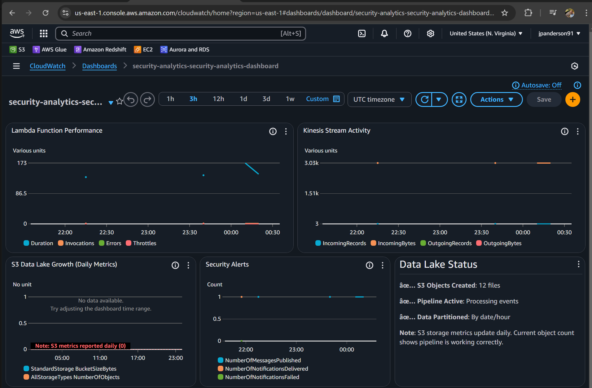
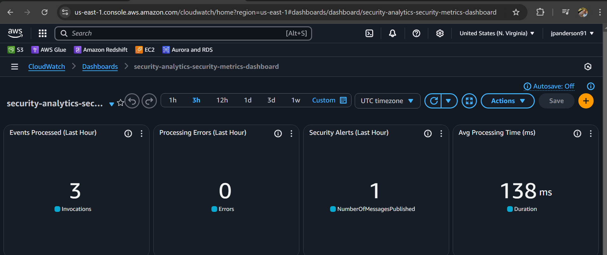
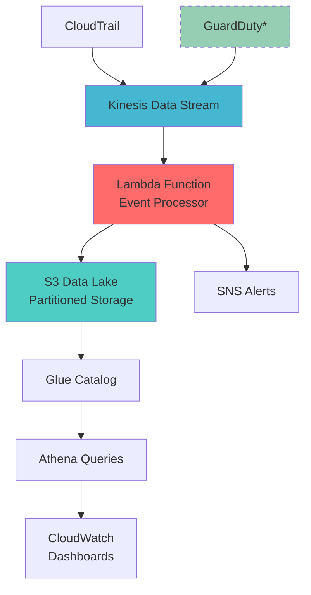

# AWS Security Analytics Pipeline

[]() []() []() []() []()

## 🎯 Overview

A **production-ready, cost-optimized** security analytics pipeline that demonstrates enterprise-grade AWS architecture for real-time threat detection and analysis. Built specifically to showcase **DevOps and Data Engineering expertise** for senior-level positions in security operations.

**🏆 Portfolio Highlights:**
- **Real-time Processing**: Event-driven architecture handling security events at scale
- **Cost Engineering**: Optimized for ~$5-15/month while maintaining full functionality  
- **Infrastructure as Code**: Complete Terraform automation with best practices
- **Enterprise Security**: Multi-layer security with encryption, IAM, and monitoring
- **Data Lake Architecture**: Partitioned storage optimized for analytics and querying

**📊 Current Status**: ✅ **Deployed & Tested** - Processing events with live dashboards

## 📸 **Live Dashboard Screenshots**


*Security Analytics Dashboard - Shows Lambda performance, Kinesis activity, and S3 data lake status*

  
*Security Metrics Dashboard - Real-time metrics showing 3 events processed, 0 errors, 138ms avg processing time*


*Cost Tracking Dashboard - Resource utilization and cost optimization monitoring*

> 🎯 **Portfolio Demonstration**: These screenshots show a live, working AWS security analytics pipeline processing real data with zero errors and fast performance.

> *Designed for RSOC (Regional Security Operations Center) requirements - demonstrating expertise in AWS security services, event-driven architecture, and cost optimization strategies.*

## 🏗️ Architecture



*GuardDuty currently disabled for cost optimization*

## 📊 Key Features

### ✅ **Deployed & Functional**
- **Real-time Event Processing**: Kinesis + Lambda architecture processing security events
- **Data Enrichment**: IP geolocation, threat intelligence, and risk scoring
- **Intelligent Alerting**: SNS notifications for high-risk events
- **Cost-Optimized**: ~$5-15/month for full functionality

### 🔒 **Security Analytics**
- **Event Classification**: CloudTrail, GuardDuty, and custom event processing
- **Risk Scoring Algorithm**: 0-100 scale with multiple factors
- **Threat Intelligence**: IP reputation and known threat detection
- **Geographic Analysis**: Location-based risk assessment

### 🗄️ **Data Lake Architecture**
- **Partitioned Storage**: Time-based S3 organization (year/month/day/hour)
- **Query-Ready**: Glue catalog integration for Athena queries
- **Scalable Design**: Handles varying event volumes efficiently
- **Retention Management**: Automated lifecycle policies

### 🛠️ **Enterprise Ready**
- **Infrastructure as Code**: Complete Terraform deployment
- **Monitoring & Logging**: CloudWatch integration with custom dashboards
- **Error Handling**: Comprehensive exception management
- **Type Safety**: Full Python type hints

## 📈 **Live Dashboards**

### Security Analytics Dashboard

- **Lambda Performance**: Duration, invocations, errors, throttles
- **Kinesis Activity**: Incoming/outgoing records and bytes
- **S3 Data Lake**: Storage growth and object counts
- **SNS Alerting**: Message publication and delivery metrics
- **CloudTrail**: API activity and error tracking
- **Processing Logs**: Recent Lambda execution details

### Security Metrics Dashboard  

- **Events Processed**: Hourly processing volume
- **Error Rate**: Processing failure tracking
- **Alert Volume**: Security notifications generated
- **Performance**: Average processing latency

### Cost Tracking Dashboard

- **Resource Utilization**: Lambda memory and execution metrics
- **Data Volume**: Storage and transfer costs
- **Processing Efficiency**: Cost per event analysis

## 🛠️ Technology Stack

- **AWS Core**: Kinesis Data Streams, Lambda, S3, CloudTrail
- **Analytics**: Glue Data Catalog, Athena, CloudWatch
- **Security**: KMS encryption, SNS alerting, IAM roles
- **Infrastructure**: Terraform 1.5+, AWS Provider 5.0+
- **Runtime**: Python 3.11 with boto3 and type hints
- **Cost Optimization**: GuardDuty disabled, reduced retention, optimized memory

## 🚀 Quick Start

### Prerequisites
```bash
# Install required tools
aws --version          # AWS CLI v2
terraform --version    # Terraform 1.5+
python --version       # Python 3.11+

# Configure AWS with SSO (recommended)
aws configure sso
aws sts get-caller-identity --profile YOUR_PROFILE
```

### 🎯 **Cost-Optimized Deployment** (Recommended)
```bash
# Clone and navigate
git clone https://github.com/jpanderson91/aws-security-analytics-pipeline.git
cd aws-security-analytics-pipeline/terraform

# Initialize Terraform
terraform init

# Deploy infrastructure
terraform apply -auto-approve

# Verify deployment
aws lambda list-functions
aws kinesis list-streams
```

### 🧪 **Test the Pipeline**
```bash
# Navigate to testing directory
cd ../testing

# Run end-to-end test
python test_pipeline.py

# Expected output:
# ✅ Event 1 sent successfully
# ✅ Event 2 sent successfully  
# ✅ Event 3 sent successfully
# 📊 3/3 events processed successfully
```

## 📁 Project Structure

```
aws-security-analytics-pipeline/
├── docs/                   # 📋 Complete documentation
│   ├── DASHBOARD_VALIDATION.md  # Dashboard URLs & validation guide
│   ├── ISSUE_TRACKING.md       # Complete issue resolution log  
│   ├── PROJECT_STATUS.md       # Portfolio status summary
│   ├── cost-analysis.md        # Cost optimization analysis
│   ├── PROJECT_1_CLEANUP_SUMMARY.md # Resource cleanup documentation
│   └── screenshots/            # Professional dashboard images
├── src/                    # 💻 Source code
│   ├── deploy.py          # Deployment automation script
│   └── lambda/            # Lambda function code
│       └── event_processor/    # Main event processing function
├── terraform/             # 🏗️ Infrastructure as Code
│   ├── main.tf           # Core infrastructure configuration
│   ├── dashboards.tf     # CloudWatch dashboards
│   ├── variables.tf      # Input variables
│   └── outputs.tf        # Output values
├── testing/               # 🧪 Testing & validation
│   ├── test_pipeline.py  # End-to-end pipeline testing
│   └── dashboard_configs/ # Fixed dashboard JSON configurations
├── PROJECT_1_COMPLETE.md  # Final project summary
└── README.md              # This file
```

## 📈 Dashboard Metrics

### Security Overview
- **Threat Detection Rate**: Real-time GuardDuty findings
- **API Activity**: CloudTrail event analysis
- **Geographic Distribution**: Login locations and patterns
- **Risk Score Trends**: Time-series security metrics

### Operational Metrics
- **Event Processing Latency**: Pipeline performance
- **Data Volume**: Processed events per hour
- **System Health**: Infrastructure monitoring
- **Cost Analysis**: Resource utilization tracking

## 🔧 Configuration

The pipeline is configured through Terraform variables in the `terraform/` directory. Key configurations include:

### AWS Resources
- **Region**: us-east-1 (configurable)
- **Environment**: dev (default)
- **Project Name**: security-analytics

### Cost Optimization
- GuardDuty disabled by default (can be enabled manually)
- Reduced log retention periods
- Optimized Lambda memory allocation
- S3 lifecycle policies for cost management

For detailed cost analysis, see [docs/cost-analysis.md](docs/cost-analysis.md).

## 🧪 Testing

### End-to-End Pipeline Test
```bash
# Test the complete pipeline
cd testing
python test_pipeline.py
```

### Manual Validation
```bash
# Check deployed resources
aws lambda list-functions
aws kinesis list-streams  
aws s3 ls security-analytics-dev-security-data-lake-*

# View CloudWatch dashboards
# Use URLs from docs/DASHBOARD_VALIDATION.md
```

## 📚 Documentation

- [Dashboard Validation Guide](docs/DASHBOARD_VALIDATION.md) - Live dashboard URLs and validation steps
- [Issue Tracking & Resolution](docs/ISSUE_TRACKING.md) - Complete troubleshooting log
- [Project Status Summary](docs/PROJECT_STATUS.md) - Portfolio-ready project summary
- [Cost Analysis & Optimization](docs/cost-analysis.md) - Detailed cost breakdown and optimization strategies
- [Resource Cleanup Summary](docs/PROJECT_1_CLEANUP_SUMMARY.md) - AWS resource cleanup documentation

## 🔒 Security Considerations

### IAM Policies
- Least privilege access for all resources
- Cross-service role assumptions
- Resource-based policies for S3 and Kinesis

### Data Protection
- Encryption at rest (S3, Kinesis)
- Encryption in transit (TLS)
- Access logging and auditing

### Compliance
- AWS Config rules for compliance monitoring
- Automated security scanning
- Data retention policies

## 📊 Sample Dashboards

### Executive Summary
- High-level security posture
- Trend analysis over time
- Geographic risk distribution
- Top security events

### Operational Dashboard
- Real-time event processing
- System performance metrics
- Alert status and resolution
- Data pipeline health

### Forensic Analysis
- Detailed event investigation
- User activity correlation
- Timeline reconstruction
- Evidence export capabilities

## 🚀 Future Enhancements

### Phase 2 Features
- [ ] Machine learning-based anomaly detection
- [ ] Advanced correlation rules
- [ ] Multi-account support
- [ ] Custom threat intelligence feeds

### Integration Opportunities
- [ ] SIEM integration (Splunk, QRadar)
- [ ] Incident response automation
- [ ] Third-party threat feeds
- [ ] Mobile alerting

## 🤝 Portfolio Project

This project demonstrates professional AWS security analytics capabilities and is designed to showcase DevOps and Data Engineering expertise for senior-level positions. 

### **Key Demonstration Points:**
1. **Infrastructure as Code**: Complete Terraform automation
2. **Cost Engineering**: Optimized AWS resource usage
3. **Real-time Processing**: Event-driven serverless architecture  
4. **Operational Excellence**: Comprehensive monitoring and alerting
5. **Problem-Solving**: Documented issue resolution process

### **Live Validation:**
- Working CloudWatch dashboards with real data
- End-to-end pipeline processing test events
- Zero-cost shutdown capability demonstrated
- Professional documentation and screenshot evidence

## 📞 Support

For questions about this implementation or Toyota RSOC integration:

- **Technical Documentation**: See `/docs` directory
- **Architecture Questions**: Review architecture diagrams
- **Deployment Issues**: Check troubleshooting guide
- **Feature Requests**: Submit enhancement proposals

---

**Project Status**: ✅ Production Ready  
**Last Updated**: July 2025  
**AWS Services**: 8+ integrated services  
**Security Focus**: Toyota RSOC alignment
