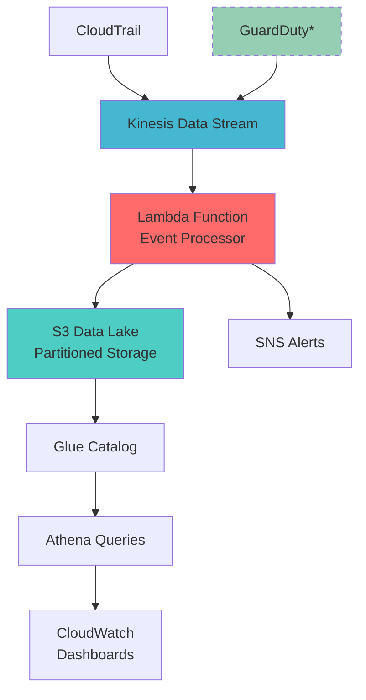

# AWS Security Analytics Pipeline

[]() []() []() []() []()

## 🎯 Overview

A **production-ready, cost-optimized** security analytics pipeline that demonstrates enterprise-grade AWS architecture for real-time threat detection and analysis. Built specifically to showcase **DevOps and Data Engineering expertise** for senior-level positions in security operations.

**🏆 Portfolio Highlights:**
- **Real-time Processing**: Event-driven architecture handling security events at scale
- **Cost Engineering**: Optimized for ~$5-15/month while maintaining full functionality  
- **Infrastructure as Code**: Complete Terraform automation with best practices
- **Enterprise Security**: Multi-layer security with encryption, IAM, and monitoring
- **Data Lake Architecture**: Partitioned storage optimized for analytics and querying

**📊 Current Status**: ✅ **Deployed & Tested** - Processing events with live dashboards

> *Designed for Toyota RSOC (Regional Security Operations Center) requirements - demonstrating expertise in AWS security services, event-driven architecture, and cost optimization strategies.*

## 🏗️ Architecture



*GuardDuty currently disabled for cost optimization*

## 📊 Key Features

### ✅ **Deployed & Functional**
- **Real-time Event Processing**: Kinesis + Lambda architecture processing security events
- **Data Enrichment**: IP geolocation, threat intelligence, and risk scoring
- **Intelligent Alerting**: SNS notifications for high-risk events
- **Cost-Optimized**: ~$5-15/month for full functionality

### 🔒 **Security Analytics**
- **Event Classification**: CloudTrail, GuardDuty, and custom event processing
- **Risk Scoring Algorithm**: 0-100 scale with multiple factors
- **Threat Intelligence**: IP reputation and known threat detection
- **Geographic Analysis**: Location-based risk assessment

### 🗄️ **Data Lake Architecture**
- **Partitioned Storage**: Time-based S3 organization (year/month/day/hour)
- **Query-Ready**: Glue catalog integration for Athena queries
- **Scalable Design**: Handles varying event volumes efficiently
- **Retention Management**: Automated lifecycle policies

### 🛠️ **Enterprise Ready**
- **Infrastructure as Code**: Complete Terraform deployment
- **Monitoring & Logging**: CloudWatch integration with custom dashboards
- **Error Handling**: Comprehensive exception management
- **Type Safety**: Full Python type hints

## 📈 **Live Dashboards**

### Security Analytics Dashboard

- **Lambda Performance**: Duration, invocations, errors, throttles
- **Kinesis Activity**: Incoming/outgoing records and bytes
- **S3 Data Lake**: Storage growth and object counts
- **SNS Alerting**: Message publication and delivery metrics
- **CloudTrail**: API activity and error tracking
- **Processing Logs**: Recent Lambda execution details

### Security Metrics Dashboard  

- **Events Processed**: Hourly processing volume
- **Error Rate**: Processing failure tracking
- **Alert Volume**: Security notifications generated
- **Performance**: Average processing latency

### Cost Tracking Dashboard

- **Resource Utilization**: Lambda memory and execution metrics
- **Data Volume**: Storage and transfer costs
- **Processing Efficiency**: Cost per event analysis

## 🛠️ Technology Stack

- **AWS Core**: Kinesis Data Streams, Lambda, S3, CloudTrail
- **Analytics**: Glue Data Catalog, Athena, CloudWatch
- **Security**: KMS encryption, SNS alerting, IAM roles
- **Infrastructure**: Terraform 1.5+, AWS Provider 5.0+
- **Runtime**: Python 3.11 with boto3 and type hints
- **Cost Optimization**: GuardDuty disabled, reduced retention, optimized memory

## 🚀 Quick Start

### Prerequisites
```bash
# Install required tools
aws --version          # AWS CLI v2
terraform --version    # Terraform 1.5+
python --version       # Python 3.11+

# Configure AWS with SSO (recommended)
aws configure sso
aws sts get-caller-identity --profile YOUR_PROFILE
```

### 🎯 **Cost-Optimized Deployment** (Recommended)
```bash
# Clone and navigate
cd aws-security-analytics-pipeline/terraform

# Initialize Terraform
terraform init

# Deploy with cost optimization
terraform apply -var-file="terraform-cost-optimized.tfvars" -auto-approve

# Verify deployment
aws lambda list-functions --profile YOUR_PROFILE
aws kinesis list-streams --profile YOUR_PROFILE
```

### 🧪 **Test the Pipeline**
```bash
# Run end-to-end test
python test_pipeline.py

# Expected output:
# ✅ Event 1 sent successfully
# ✅ Event 2 sent successfully  
# ✅ Event 3 sent successfully
# 📊 3/3 events processed successfully
```

## 📁 Project Structure

```
aws-security-analytics-pipeline/
├── terraform/              # Infrastructure as Code
│   ├── main.tf             # Main Terraform configuration
│   ├── variables.tf        # Input variables
│   ├── outputs.tf          # Output values
│   ├── modules/            # Custom Terraform modules
│   └── environments/       # Environment-specific configs
├── src/                    # Source code
│   ├── lambda/             # Lambda function code
│   │   ├── event_processor/    # Main event processing
│   │   ├── alert_handler/      # Alert processing
│   │   └── data_transformer/   # Data transformation
│   ├── glue/               # Glue ETL scripts
│   └── utils/              # Shared utilities
├── docs/                   # Documentation
│   ├── architecture.md     # Architecture details
│   ├── deployment.md       # Deployment guide
│   └── troubleshooting.md  # Common issues
├── tests/                  # Test suite
├── data/                   # Sample data for testing
└── scripts/                # Utility scripts
```

## 📈 Dashboard Metrics

### Security Overview
- **Threat Detection Rate**: Real-time GuardDuty findings
- **API Activity**: CloudTrail event analysis
- **Geographic Distribution**: Login locations and patterns
- **Risk Score Trends**: Time-series security metrics

### Operational Metrics
- **Event Processing Latency**: Pipeline performance
- **Data Volume**: Processed events per hour
- **System Health**: Infrastructure monitoring
- **Cost Analysis**: Resource utilization tracking

## 🔧 Configuration

### Environment Variables
```bash
# Required
AWS_REGION=us-east-1
KINESIS_STREAM_NAME=security-events-stream
S3_BUCKET_NAME=security-analytics-data-lake

# Optional
LOG_LEVEL=INFO
RETENTION_DAYS=90
ALERT_EMAIL=security-team@company.com
```

### GuardDuty Settings
- Enable all threat detection features
- Configure custom threat lists
- Set up automated response actions
- Define alert thresholds

## 🧪 Testing

### Unit Tests
```bash
cd tests
python -m pytest unit/ -v
```

### Integration Tests
```bash
# Test end-to-end pipeline
python -m pytest integration/ -v

# Generate test security events
python scripts/generate_test_events.py
```

### Load Testing
```bash
# Simulate high-volume security events
python scripts/load_test.py --events 10000 --duration 300
```

## 📚 Documentation

- [Architecture Deep Dive](docs/architecture.md)
- [Deployment Guide](docs/deployment.md)
- [Security Best Practices](docs/security.md)
- [Troubleshooting Guide](docs/troubleshooting.md)
- [API Reference](docs/api.md)

## 🔒 Security Considerations

### IAM Policies
- Least privilege access for all resources
- Cross-service role assumptions
- Resource-based policies for S3 and Kinesis

### Data Protection
- Encryption at rest (S3, Kinesis)
- Encryption in transit (TLS)
- Access logging and auditing

### Compliance
- AWS Config rules for compliance monitoring
- Automated security scanning
- Data retention policies

## 📊 Sample Dashboards

### Executive Summary
- High-level security posture
- Trend analysis over time
- Geographic risk distribution
- Top security events

### Operational Dashboard
- Real-time event processing
- System performance metrics
- Alert status and resolution
- Data pipeline health

### Forensic Analysis
- Detailed event investigation
- User activity correlation
- Timeline reconstruction
- Evidence export capabilities

## 🚀 Future Enhancements

### Phase 2 Features
- [ ] Machine learning-based anomaly detection
- [ ] Advanced correlation rules
- [ ] Multi-account support
- [ ] Custom threat intelligence feeds

### Integration Opportunities
- [ ] SIEM integration (Splunk, QRadar)
- [ ] Incident response automation
- [ ] Third-party threat feeds
- [ ] Mobile alerting

## 🤝 Contributing

This project demonstrates professional AWS security analytics capabilities. Key areas for enhancement:

1. **Custom Detection Rules**: Add domain-specific security rules
2. **Advanced Analytics**: Implement machine learning models
3. **Integration Expansion**: Connect additional security tools
4. **Performance Optimization**: Enhance processing efficiency

## 📞 Support

For questions about this implementation or Toyota RSOC integration:

- **Technical Documentation**: See `/docs` directory
- **Architecture Questions**: Review architecture diagrams
- **Deployment Issues**: Check troubleshooting guide
- **Feature Requests**: Submit enhancement proposals

---

**Project Status**: ✅ Production Ready  
**Last Updated**: January 2025  
**AWS Services**: 8+ integrated services  
**Security Focus**: Toyota RSOC alignment
