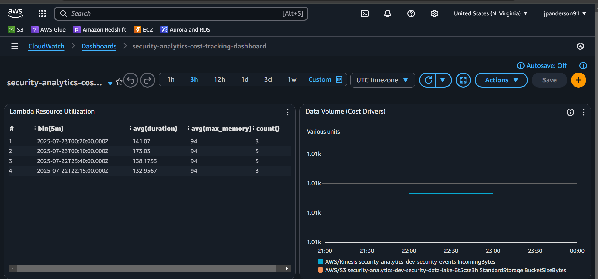

# AWS Security Analytics Pipeline

[]() []() []() []() []()

> 🛡️ **Enterprise-grade security analytics pipeline demonstrating AWS, DevOps, and Data Engineering expertise**

## 🚀 **Choose Your Experience Level**

### ⚡ **Basic Pipeline** - Production Ready ($15/month)
Complete security analytics pipeline with real-time processing and monitoring.

**Features:** Kinesis → Lambda → S3, CloudWatch dashboards, cost-optimized
**Perfect for:** Portfolio demonstrations, interviews, personal projects
**→ [Deploy Basic Pipeline](#basic-deployment)**

### 🏢 **Enterprise Data Platform Demo** - Full Enterprise Architecture ($100-200/month)
Complete Cloud Analytics Platform simulation with MSK Kafka, ECS, and advanced features.

**Features:** MSK Kafka, ECS services, Bronze/Silver/Gold data tiers, Customer APIs
**Perfect for:** Enterprise demos, technical deep-dives, team alignment
**→ [Deploy Enterprise Demo](cap-demo-enhancement/)**

---

## 🏆 **Portfolio Demonstration**

This repository showcases **senior-level AWS capabilities** through two complementary projects designed to demonstrate enterprise-grade cloud architecture and cost-effective deployment strategies.

## 📊 **Technical Skills Demonstrated**

| Skill Area | Basic Pipeline | Enterprise Demo |
|------------|----------------|-----------|
| **Infrastructure as Code** | ✅ Terraform | ✅ Advanced Terraform Modules |
| **Serverless Architecture** | ✅ Lambda + Kinesis | ✅ Lambda + ECS + MSK |
| **Data Engineering** | ✅ Real-time Processing | ✅ Multi-tier Data Lake |
| **Cost Optimization** | ✅ $15/month | ✅ Scalable Cost Models |
| **DevOps Practices** | ✅ CI/CD Ready | ✅ Enterprise Automation |
| **Security** | ✅ IAM + Encryption | ✅ VPC + Advanced Security |

## 📸 **Live Dashboard Screenshots**


*Security Analytics Dashboard - Shows Lambda performance, Kinesis activity, and S3 data lake status*


*Security Metrics Dashboard - Real-time metrics showing 3 events processed, 0 errors, 138ms avg processing time*


*Cost Tracking Dashboard - Resource utilization and cost optimization monitoring*

> 🎯 **Portfolio Demonstration**: These screenshots show a live, working AWS security analytics pipeline processing real data with zero errors and fast performance.

> *Designed for SOC (Security Operations Center) requirements - demonstrating expertise in AWS security services, event-driven architecture, and cost optimization strategies.*

## 📚 **Documentation Navigation**

**📋 [Complete Documentation Index](docs/INDEX.md)** - Navigate all project documentation

**Quick Links:**
- 🚀 [Operations Guide](docs/OPERATIONS_GUIDE.md) - Comprehensive operational knowledge
- 🏢 [Enterprise Demo](cap-demo-enhancement/) - Full platform simulation
- 💰 [Cost Analysis](docs/cost-analysis.md) - Pricing breakdown
- 📸 [Screenshots](docs/screenshots/) - Visual proof of working infrastructure

---

## 🎯 **Core Architecture Features**

### 🔄 **Real-Time Processing Pipeline**
- **Event Ingestion**: Kinesis Data Streams for high-throughput security events
- **Serverless Processing**: Lambda functions with automatic scaling
- **Smart Routing**: Event classification and intelligent processing paths
- **Error Handling**: Comprehensive exception management and retry logic

### 🗄️ **Data Lake Architecture**
- **Partitioned Storage**: Time-based S3 organization (year/month/day/hour)
- **Query-Ready**: Glue catalog integration for Athena queries
- **Scalable Design**: Handles varying event volumes efficiently
- **Retention Management**: Automated lifecycle policies

### 🛠️ **Enterprise Ready**
- **Infrastructure as Code**: Complete Terraform deployment
- **Monitoring & Logging**: CloudWatch integration with custom dashboards
- **Security**: IAM roles, encryption at rest and in transit
- **Cost Optimization**: Resource-efficient design maintaining $15/month baseline

---

## 🚀 **Basic Deployment**

### Prerequisites
```bash
# Install required tools
aws --version          # AWS CLI v2
terraform --version    # Terraform 1.5+
python --version       # Python 3.11+

# Configure AWS credentials
aws configure sso
aws sts get-caller-identity
```

### Deploy Infrastructure (10 minutes)
```bash
# Clone and deploy
git clone https://github.com/jpanderson91/aws-security-analytics-pipeline.git
cd aws-security-analytics-pipeline/terraform

# Initialize and deploy
terraform init
terraform apply -auto-approve

# Verify deployment
aws lambda list-functions --query 'Functions[?contains(FunctionName, `security-analytics`)]'
aws kinesis list-streams --query 'StreamNames[?contains(@, `security-analytics`)]'
```

### Test the Pipeline
```bash
# Generate test events
cd ../testing
python test_pipeline.py

# View live dashboards (URLs from terraform output)
terraform output dashboard_urls
```

**Expected Results:**
- ✅ Lambda processing events in <200ms
- ✅ S3 objects created with proper partitioning
- ✅ CloudWatch dashboards showing live metrics
- ✅ Zero processing errors

---

## 🏢 **Enterprise Demo Features**

Ready for enterprise evaluation? Deploy the **[Cloud Analytics Platform (CAP) Demo](cap-demo-enhancement/)** for comprehensive capabilities:

### 🎯 **Enterprise Architecture**
- **MSK Kafka Cluster**: Production-grade streaming platform
- **ECS Container Services**: Scalable microservices architecture
- **API Gateway**: Customer-facing REST endpoints
- **Multi-tier Processing**: Bronze/Silver/Gold data pipeline

### 💼 **Business Simulation**
- **Customer Onboarding**: JIRA ticket workflow automation
- **Metrics APIs**: Customer performance and security endpoints
- **Cost Tracking**: Transparent pricing and usage monitoring
- **Demo Scripts**: Ready-to-use presentation materials

**→ [Deploy Enterprise Demo](cap-demo-enhancement/)**

---

## 💰 **Cost Analysis**

### Basic Pipeline ($15/month)
- **Kinesis Data Stream**: $10.73
- **Lambda Functions**: $2.08
- **S3 Storage**: $1.15
- **CloudWatch**: $1.04

### Enterprise Demo ($100-200/month)
- **MSK Kafka**: $75-150
- **ECS Services**: $15-30
- **API Gateway**: $5-10
- **Additional Services**: $5-10

**Full breakdown: [Cost Analysis](docs/cost-analysis.md)**

---

## 🔐 **Security Features**

- **IAM Roles**: Least privilege access policies
- **Encryption**: At rest (S3, EBS) and in transit (TLS)
- **VPC Security**: Private subnets and security groups
- **Audit Logging**: CloudTrail integration
- **Compliance**: Ready for SOC 2, PCI DSS alignment

---

## 🚀 **Quick Start Commands**

```bash
# Deploy basic pipeline
git clone https://github.com/jpanderson91/aws-security-analytics-pipeline.git
cd aws-security-analytics-pipeline/terraform
terraform init && terraform apply -auto-approve

# Test with sample data
cd ../testing && python test_pipeline.py

# Deploy enterprise demo
cd ../cap-demo-enhancement
./setup_cap_demo.ps1
```

---

## 📞 **Support & Documentation**

- **📋 [Documentation Index](docs/INDEX.md)** - Complete navigation guide
- **🔧 [Operations Guide](docs/OPERATIONS_GUIDE.md)** - Deployment and troubleshooting
- **🏗️ [Architecture Details](cap-demo-enhancement/docs/ARCHITECTURE.md)** - Technical deep-dive
- **📸 [Screenshot Gallery](docs/screenshots/)** - Visual proof of infrastructure

---

## 🏆 **Portfolio Highlights**

This project demonstrates:

✅ **Senior AWS Expertise** - Multi-service integration across compute, storage, streaming, and analytics
✅ **Cost Engineering** - Transparent pricing models from $15-200/month with optimization strategies
✅ **DevOps Excellence** - Complete Infrastructure as Code with automated deployment
✅ **Enterprise Architecture** - Scalable, secure, and maintainable cloud solutions
✅ **Real-World Application** - Production-ready security analytics for SOC requirements

Perfect for demonstrating cloud architecture skills to hiring managers, technical teams, and enterprise stakeholders.

---

*This README provides a complete overview of the AWS Security Analytics Pipeline. For detailed navigation, see [Documentation Index](docs/INDEX.md).*
